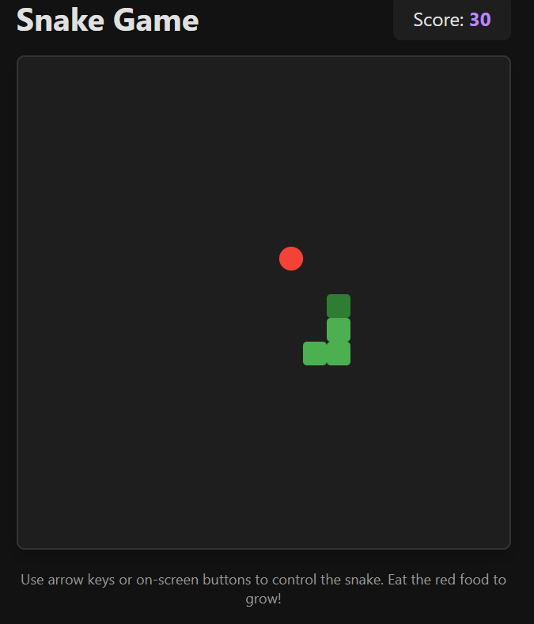
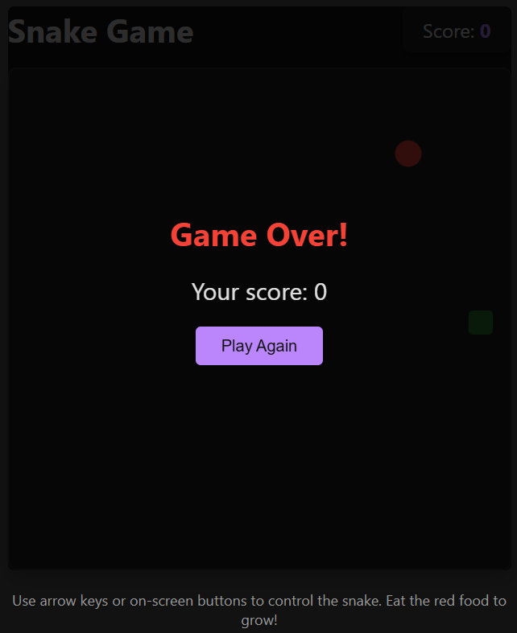

# 🐍 Snake Game - Dark Theme

()

A modern, responsive Snake game with sleek dark theme built with HTML, CSS, and JavaScript.

## 🎮 Features

- Classic Snake gameplay with growing mechanics
- Dark theme with modern UI
- Fully responsive (desktop & mobile)
- Score tracking with increasing difficulty
- Visual effects (pulsing food, smooth transitions)
- Keyboard and touch controls
- Game over detection

## 🚀 How to Play

### Desktop

- Use arrow keys (↑ ↓ ← →) to control the snake

### Mobile

- Use on-screen directional buttons

### Game Rules

1. Eat red food to grow and score points
2. Avoid walls and your own tail
3. Game speeds up as you score
4. Click "Play Again" after game over

## 🛠️ Installation

```bash
git clone https://github.com/your-username/snake-game.git
cd snake-game
open index.html
```


## 🤝 Contributing
Pull requests welcome! For major changes, please open an issue first.

## 📷 Screenshots
()


